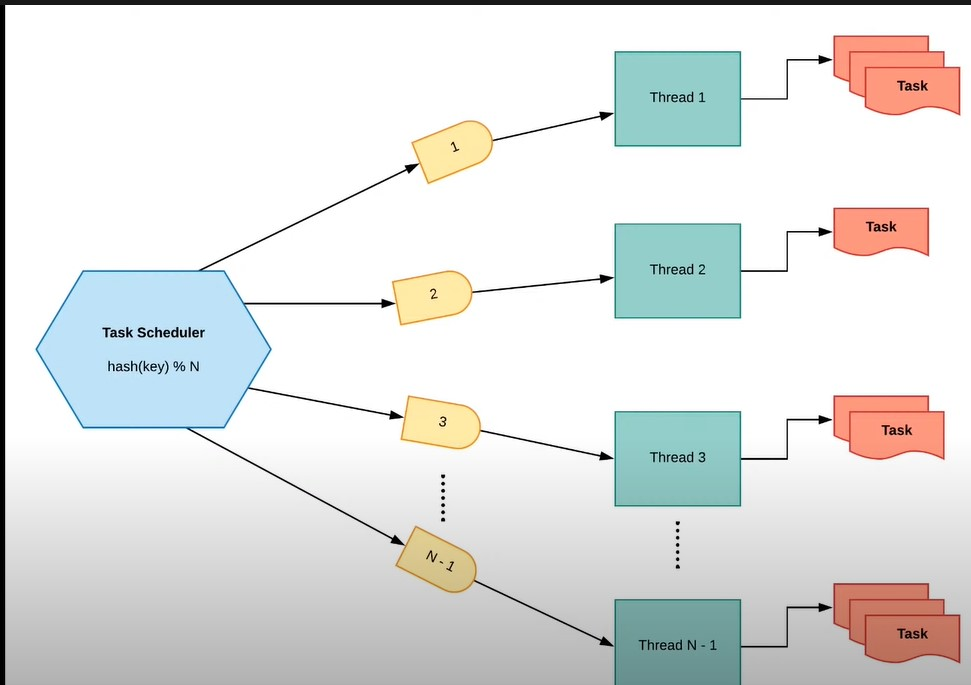

## Google low level design logger

- Logger is designed for concurrency and locking.

### System Design

    

- A task scheduler is responsible for managing and executing threads which `start` and `end` the logging. In order to ensure the `start` method is called before the `end` method,
a consistent hashing algorithm is used which points to the same thread which is responsible for starting and ending the same `Process`. 
- The same thread must be starting and stopping a process as each thread has it's own callstack which maintains order of methods called. In a multihreaded environment, many threads are active and the end method can be called before the start, resulting in memory leaks due to the process never ending (end called first, then start method called next)

### Data Structures

- `ConcurrentHashMap`- uses a multitude of locks (16 by default); each lock controls one segment of the hash. When setting data for a specific segment, 
the lock for that segment is acquired and is only getting locked while adding or updating the map. This allows concurrent threads to read the value without locking at all.
- `TreeMap` - In comparison to a HashMap, TreeMap is sorted by keys and implemented as a `Red black tree`, not a `Binary search tree`. Time complexity is `O(log n)` for insertion and deletion. Ordering is needed as a history of log metadata needs to be kept which shows when logs were started and ended.
- `ConcurrentSkipListMap` - Used as a queue. Initially designed with a TreeMap for ordering, however TreeMap is not thread safe. 
- `LinkedBlockingQueue` - Optionally bounded blocking queue, nodes are kept in linked structure and stores them in 
FIFO structure. The head of queue is the lement which has been in the queue the longest, the tail the shortest. 
`blockingQueue.take()` will pop the head element off the queue.
- `CopyOnWriteArrayList` - Thread safe, is synchronized therefore only one thread can access at a time.

#### Based off of Gourav Sen's Google Low Level Design: [Google LLD](https://github.com/coding-parrot/projects)
